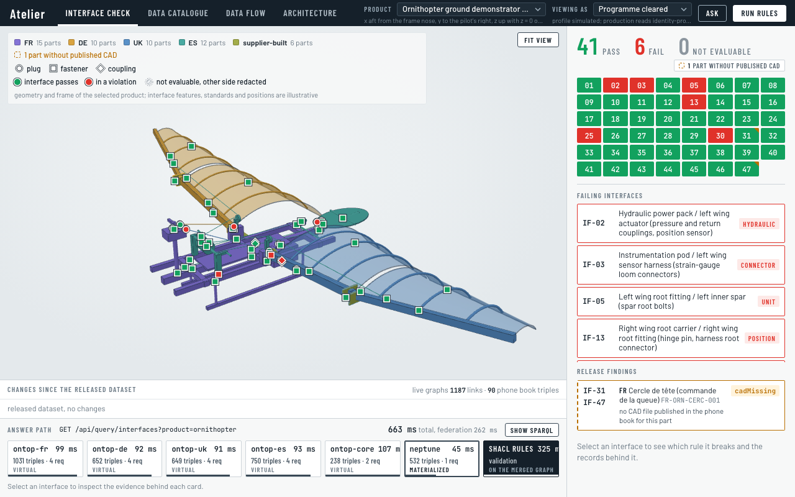
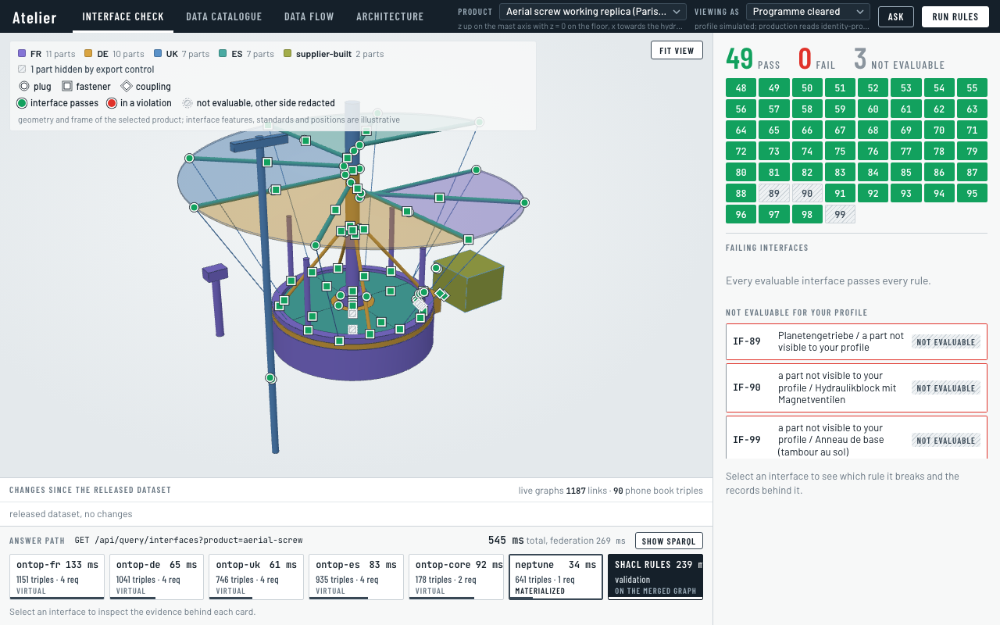

# Atelier: a PLM semantic layer sample

What if Leonardo had to build his machine from four workshops' data? Four
countries, four product lifecycle management (PLM) systems, one machine: each
workshop keeps its parts in its own database, with its own schema, language and
units. Inside each system the data is consistent. The joints between parts owned
by different systems are where it disagrees: a plug positioned off its mate, a
connector type that differs, a position stored without its unit, a pressure in
psi against one in bar. No system owns the joint, so no system checks it.

Atelier is a semantic layer, one vocabulary over many databases, so people and
agents ask once. It reads the PLM databases in place, checks every joint with
deterministic rules and shows the evidence behind each verdict, enforces export
control inside the queries, and answers an agent through the same tools it
answers a person.

An **interface** is a mechanical joint between two parts, with the plugs,
fasteners and hydraulic couplings that cross it, each declared by the PLM that
owns its part. Checking the interfaces is the layer's job.

No site holds a complete product either. Each workshop holds its own slice as a
**bill of materials** (BOM), a tree under its own site kit, in its own relational
idiom: a parent column on the German part row, a French link table, a versioned
JSON document on the Spanish parent row, British indented rows. The product root
exists only in the semantic layer, which reads the four idioms as one relation
and answers what no site can: the whole bill of materials of a product, part
occurrences and mass rolled up by site and overall, and where a part is used.

A product is more than geometry: flight software, a setting manual and a type
certificate are items of the product, released and revised like parts, with no
CAD file. And a product-level rule is a SPARQL aggregate over every site's parts
that no single PLM can evaluate: the CubeSat's sites together weigh 2.010 kg
against its 2.000 kg 1U limit (`massLimit`), and the difference engine's French
site writes grams into its kilogram column, so its median part weighs 119 times
the other sites' (`massScale`). Both are findings of the product, shown under
the product switcher; `massScale` also marks each part of the French site. A
viewer who may not see every item of a product cannot weigh it: for that viewer
the rules are not evaluable, as an interface with a hidden side is not.

Atelier runs over four site PLM databases, France, Germany, the United
Kingdom and Spain, each with its own relational schema in its own language, the
British one storing positions in inches with a per-row unit column. The layer
reads them in place through Ontop virtual knowledge graphs whose mappings are
generated from the Java object-relational mapping (ORM) annotations, keeps only
the cross-system facts in Amazon Neptune, and federates one plain request per
source with Apache Jena. It validates the merged graph with SHACL (Shapes
Constraint Language) and SPARQL rules, converting units through the QUDT
vocabulary (Quantities, Units, Dimensions and Types). Every answer returns its
evidence: the request sent to each source, the SQL Ontop generated, the native
rows, the mapping, the shapes and the validation report.

Ten products share the deployment and the same four workshops, two of them
Leonardo's flying machines: an ornithopter ground demonstrator and an aerial screw working replica, both built from
Leonardo da Vinci's Paris Manuscript B drawings. A React and three.js front end
renders each product from per-part STEP files (ISO 10303, the CAD exchange
format). A Strands agent answers questions in the browser through the same
twenty-five MCP (Model Context Protocol) tools that any MCP client, Kiro or Claude
Code, can use. The design follows the AWS Prescriptive Guidance [Semantic layer
for agentic AI using ontology, symbolic reasoning, and a virtual knowledge
graph](https://docs.aws.amazon.com/prescriptive-guidance/latest/semantic-layer-agentic-ai-ontology-reasoning-virtual-knowledge-graph/).





`docs/contract.md` is the integration contract every component follows;
`docs/walkthrough.md` is a tour of the running sample; `docs/kiro-mcp.md`
connects a desktop MCP client.

## Architecture

| Layer | Component |
|---|---|
| Sources | One Aurora PostgreSQL Serverless v2 cluster with five databases: `fr_plm`, `de_plm`, `uk_plm`, `es_plm` (the sites' PLM schemas, never modified) and `atelier_core` (the integrator's own data: export-control tags and the product structure) |
| ORM and catalogue | Five Spring Boot services (Hibernate, MapStruct, Flyway), one per database. The JPA (Jakarta Persistence) annotations `@OntologyClass`, `@Describe`, `@Unit` and `@Maps` produce the data catalogue and the R2RML (RDB to RDF Mapping Language) mappings; a CI job regenerates the mappings and fails when the committed files differ |
| Virtual graphs | Five Ontop endpoints, one per database, each running the generated R2RML over the live tables |
| Materialised graph | Amazon Neptune, three named graphs: the interface links (`atelier:matesWith`, and `owl:sameAs` between parts a user confirmed as one item), the file index (`atelier:cadFile` per part, `atelier:builtBy` for supplier-built parts) and the labels (each item's native and English names, the products' glossary as the SKOS scheme `atelier:Terms`), nothing else |
| Query service | Apache Jena: one plain request per source, merge, SHACL and SPARQL rules with QUDT unit conversion, evidence per answer, the MCP server |
| Agent | Strands agent speaking AG-UI (the Agent-User Interaction protocol) over Server-Sent Events (SSE) to the browser's Ask panel; its tools are the MCP tools plus ten frontend tools the browser carries out on its screens and in the 3D viewer |
| Front end | React, three.js and occt-import-js (STEP files decoded in a Web Worker), React Flow for the data-flow view, the bill-of-materials tree, evidence drawers, Ask panel, and a Rules screen that explains every SHACL shape with its Turtle, its SPARQL, the ontology terms it reads, the product's seeded data that trigger it and the records it fails for the profile in the product on screen, with a count of the other products where it fails |
| Events | Amazon EventBridge default bus: the PLM services publish `part.value.corrected` and `part.cad.published`, the core service publishes `interface.link.added`; a loader Lambda applies the PLM events |
| Edge | Amazon CloudFront in front of everything, with Amazon Cognito sign-in at the edge (a Lambda@Edge function on every behaviour); `/api/*` goes to an Amazon API Gateway HTTP API protected by an origin-secret authorizer, `/agent/*` to an internal Application Load Balancer through a VPC origin |
| Compute and network | Amazon ECS on AWS Fargate (arm64) in private subnets with AWS Cloud Map; AWS Lambda for the database bootstrap, the links loader, the API authorizer and the edge sign-in; secrets in AWS Secrets Manager |

## Ten products, one layer

| Product | Source drawing | Parts | Interfaces | Features | Bill of materials |
|---|---|---|---|---|---|
| Ornithopter ground demonstrator | Paris Manuscript B, folio 74v (about 1487 to 1490), scaled from the Museo Galileo working model | 76 (FR 22, UK 18, DE 15, ES 21) | 76, of which 25 between parts of different PLMs | 36 plugs, 126 fasteners, 28 hydraulic couplings | 6 assemblies, 78 lines, 90 part occurrences |
| Aerial screw working replica | Paris Manuscript B, folio 83v (about 1489), a 1:2 replica 4.67 m across | 36 (FR 11, DE 11, UK 7, ES 7) | 52, of which 38 between parts of different PLMs | 72 plugs, 90 fasteners, 10 hydraulic couplings | 4 assemblies, 36 lines, 36 part occurrences |
| Self-propelled cart (Codex Atlanticus, f. 812r) | Codex Atlanticus, folio 812r (about 1478-1480), a full-size working reconstruction 1.7 m long | 27 (FR 5, DE 11, UK 4, ES 7) | 20, of which 11 between workshops | 1 plug, 44 fasteners, 0 couplings | 4 assemblies, 27 lines, 27 part occurrences |
| Antikythera mechanism, simplified interpretation | a simplified interpretation of the mechanism, a museum-scale bronze model in an open wooden case 180 x 96 x 340 mm | 33 (FR 8, DE 12, UK 7, ES 6) | 21, of which 16 between workshops | 2 plugs, 42 fasteners, 0 couplings | 4 assemblies, 33 lines, 33 part occurrences |
| Watt rotative beam engine, simplified (1788 type) | the 1788 type, a double-acting demonstrator with a centrifugal governor, bed 7 m long | 28 (FR 6, DE 9, UK 6, ES 7) | 24, of which 11 between workshops | 4 plugs, 38 fasteners, 12 couplings | 4 assemblies, 28 lines, 30 part occurrences |
| Lilienthal Normalsegelapparat (1894), authored reconstruction | the 1894 Normalsegelapparat, span 6.7 m, eight radial ribs per folding wing, about 13 m² and 20 kg | 83 (FR 12, DE 17, UK 10, ES 44) | 48, of which 40 between workshops | 3 plugs, 92 fasteners, 0 couplings | 18 assemblies, 108 lines, 420 part occurrences |
| 1U CubeSat, authored demonstrator | a generic 1U CubeSat authored inside the Design Specification envelope, 100 mm cube | 26 (FR 5, DE 8, UK 9, ES 4) | 25, of which 19 between workshops | 16 plugs, 36 fasteners, 0 couplings | 4 assemblies, 1 software item, 27 lines, 26 part occurrences |
| Difference engine No. 2 design, authored reconstruction | the No. 2 design (1847-49), authored reconstruction; eight columns of 31 figure wheels | 192 (FR 58, DE 59, UK 41, ES 34) | 45, of which 20 between workshops | 3 plugs, 88 fasteners, 0 couplings | 66 assemblies, 2 documents, 262 lines, 7,484 part occurrences |
| 5 MW reference-class wind turbine, authored | public reference figures of a 5 MW class turbine, 126 m rotor, 90 m hub height | 166 (FR 35, DE 57, UK 42, ES 32) | 40, of which 23 between workshops | 22 plugs, 50 fasteners, 10 couplings | 58 assemblies, 2 software items and 1 document, 239 lines, 3,738 part occurrences |
| Six-wheel rocker-bogie rover, authored | a generic six-wheel rocker-bogie layout built from purchased parts | 110 (FR 18, DE 25, UK 32, ES 35) | 45, of which 19 between workshops | 20 plugs, 72 fasteners, 0 couplings | 49 assemblies, 1 software item, 199 lines, 819 part occurrences |

The last three products are larger, with 192, 166 and 110 unique part numbers; their bills of materials multiply
them into 7,484, 3,738 and 819 part occurrences. Each site stores where the occurrences of its lines sit, in its own
idiom and units (`/query/placements`): the viewer loads each part's STEP file once and draws it, instanced, at every
occurrence the placements give, so the rover shows its six wheels and the wind turbine its three blades; the Bill of
materials screen counts every occurrence and the mass per site and in total. Any assembly opens as a subtree: the layer asks the
owning site for that assembly's tree, which the site's database reads from its closure table by index, follows the tree's
external references into the other sites, and the interface check, the rules and the viewer then cover that subtree
only.

Four products carry variant groups, each one installation slot and the options it can take: the wind turbine's
foundation, the beam engine's acting and governor, the difference engine's output apparatus, and the ornithopter's
wing return and crank build. The base product is the default configuration; every other option states what it adds,
replaces and removes. Each site stores the rows that exist only under an option with the option's code, and every
feature's port, the connection point a host part offers the slot; the link store's options graph holds the groups.
The option switch on the Interface check (`/query/variant-diff`, the `variant_diff` tool) compares an option with the
default port by port on the parts both configurations hold, with the rules run on each: the ornithopter's spring
return brings the UK spring's 0.3150 in anchor pin against the FR 10 mm bore, and the crank forged in one piece clears
the `IF-25` fastener mismatch. The viewer draws the configuration the option makes (`option=` on the parts and
placements answers): the springs in place of the return cords, the offshore transition piece and monopile in place of
the anchor cage.

A workshop never copies another workshop's part: it names it by URN, `urn:plm:<site>:part:<local id>`, with the
revision it expects, in its own external-reference table. Only the layer sees both ends, so only the layer can say that
a reference points at nothing (`danglingReference`) or at a revision that has moved on (`staleRevision`); the interface
check shows each part's references with their status, and `/query/references` lists a product's.

Each workshop also releases its items in its own words: Freigegeben, Publié, Liberado, Released. Only the layer holds
both the canonical lifecycle and the dependencies across sites, so only the layer sees a released item that depends on
one another site, or its own, has not released or has blocked (`lifecycleConflict`): the steam engine's released
steam pipe references a cylinder still in work, the glider's released wing covering and its binding reference a blocked leading rib, the
rover's released wheel references a hub insert that exists only as a draft. A dependency is a bill-of-materials child
or an external reference's target; the finding is on the part, the products answer counts it and the Bill of materials
screen marks the node.

A bill of materials says what contains what; a product also has function: power, load and current pass from part to
part across the sites. The layer holds that as its own engineering knowledge, a directed `atelier:drives` relation in the
link store, so only the layer can follow a path through the product, show it and compute along it. The Paths screen
follows the flow from a part (the cart's drive spring through its crown wheel and lantern pinion to both drive wheels,
across a seeded interface that fails) or the interfaces joining two parts, isolates the path in the viewer and marks each
joint in its rule status. Gears state their tooth count and module in their site's idiom, so the layer multiplies the
stages out: the wind turbine's gear train from the hub gives 97.02, and the hub's 12.1 rpm through it matches the
generator's rated 1173.7 rpm within 1 %. A gear driven by a gear of another module after unit conversion is a finding on
the driven gear (`meshModule`): the turbine's high-speed pinion is recorded at 18 mm against its 20 mm wheel.

The French workshop at Amboise integrates the two flying machines; on the eight further products each workshop builds to its specialty (German machining, gears and shafts; French composites, fabric and springs; Spanish castings, sheet metal and piping; British electronics and control); the German, British and
Spanish workshops own their parts in their own PLMs. Some parts are built by
fictional suppliers, for example Forja del Tajo in Toledo and Sheaf Hydraulik Works in
Sheffield, recorded as `atelier:builtBy` in the file index; the rover is built
mostly from purchased parts. Its four sites buy one M3 socket head cap screw under
four part numbers, two described in millimetres and two in inches, under four
designations of one standard (DIN 912, NF EN ISO 4762, BS EN ISO 4762, UNE-EN ISO 4762);
no site can see that, and the layer groups them as one item because the ontology's
standards scheme names one kind of item and the converted sizes agree. The same holds for the O-rings of the wind
turbine's pitch and yaw hydraulics and the beam engine's steam seals: the German site names a ring by its ISO 3601-1
code, the British one by its size in inches, the Spanish one in millimetres, each writing the compound in its own
language, and the layer's item classes (fastener, O-ring, placard, container, tyre, wheel, brake, cord, canister) name the attributes that make two items one, so it
groups them and states the stocking line: two or three part numbers, each expiring on the shelf, that are one stock
line once confirmed. Each site keeps its own supplier list: the layer names
the suppliers each site depends on, the single-source parts and the bearing whose two
preferred offers disagree on the lead time (the `conflictingLeadTime` finding), in a
Suppliers section of the Interface check screen, where `programme-cleared` or the officer
confirms a proposed group as one item ("Confirm equivalence"), which the core service writes
as `owl:sameAs` in the links graph and the reset removes. No real company is
named anywhere in the data.

Each workshop names its parts in its own language only. The layer publishes, in a labels graph
of its own, every part's English name beside its native one and the products' glossary in
English, German, French and Spanish, so the part block and the bill of materials show the
English name under the native one, and one word finds the parts of every site:
`/query/terms?q=Zahnrad`, `?q=roue` and `?q=gear` all resolve to the gear and list the German
Antriebszahnrad, the French pignon and the British spur gear (the `find_term` tool).

The Interface check viewer has a lens strip that fades the parts by site, lifecycle state,
supplier (one that built or offers the part), part type or material, or shows the product as released; the lens rides in the
URL hash, so a shared link opens the same view.

Several products are the point: the ontology, the shapes, the mappings, the tools
and the screens are the same for every product. The ornithopter carries the seven seeded
data defects (a position off the joint plane, a connector type mismatch, a row
stored without its unit, a coupling rated in psi against one rated in bar, a
water coupling whose psi figure sits in a bar column, a fastener diameter
mismatch and an orphan plug) and the two publication cases (a
part released without a published CAD file, a mating link to publish). Every
seeded defect of every product is fixable from the screen by the site that owns
the record: "Release correction in <PLM> PLM" proposes the correction from the
evidence, in the site's own table, words and units, and the rule passes on the
next read. "Preview" beside it runs the rules on the values entered without
releasing them, on a copy of the merged graph, and shows what the correction
fixes, leaves failing or makes fail (`POST /api/query/preview`); the layer itself never edits a site's data, and the demo reset undoes
every correction (docs/contract.md, "Freshness and the change feed"). The
aerial screw is clean; its hydraulic motor is released only after an
export-licence review, so it is the product on which the export-control officer
and the programme-cleared profile see different things. `data/products/<key>.json`
is the single source of truth for each product; `data/generate.py` derives the
seed migration of every service, the links graph, the file index and the labels graph from those
files, checks the dataset against the contract and prints the figures above
with the tally of every profile.

## Export control

Classification lives in the integrator's own database (`atelier_core.part_tag`),
one row per part, never in the PLM tables. Each row carries the part's
jurisdiction, its releasability token, the PLM that tagged it and when; the
sample seeds the rows with `data/generate.py` from `data/products/*.json`. The
jurisdictions in the data are `NONE`, `NATIONAL-<country>`, `EU-DUAL-USE` and
`EXPORT-LICENCE` and `US-EAR`. Every request
carries the viewer profile in the `x-atelier-profile` header: `fr-engineer`,
`de-engineer`, `uk-engineer`, `es-engineer`, `programme-cleared` or
`export-officer`; an absent or unknown value is the `unknown` profile, which
sees only unrestricted parts. The profile is chosen in the UI.

Enforcement happens in the query, not on the screen: the releasability filter is
pushed into the SQL Ontop generates over `part_tag`, the PLM endpoints are then
asked only for the visible parts, and the merged graph is filtered again before
validation. An interface with a hidden side is reported as not evaluable rather
than passed or failed, and hidden parts are never named. CAD files reach the
browser only as presigned S3 URLs issued for visible parts. The agent forwards
the same header and adds `x-atelier-actor: agent`, so provenance tells an
agent's call from a person's.

Tallies (pass / fail / not evaluable), computed by `data/generate.py` from the
data and `ontology/policy.json`:

| Profile | Ornithopter (76 interfaces) | Aerial screw (52 interfaces) |
|---|---|---|
| export-officer | 69 / 7 / 0 | 52 / 0 / 0 |
| programme-cleared, fr-engineer | 69 / 7 / 0 | 49 / 0 / 3 |
| de-engineer, uk-engineer, es-engineer | 66 / 5 / 5 | 49 / 0 / 3 |
| unknown | 60 / 4 / 12 | 44 / 0 / 8 |

## The agent and the MCP tools

The query service is an MCP server over streamable HTTP at `/api/query/mcp`
with twenty-five read-only tools: `products`, `list_interfaces`, `parts`, `interface_check`,
`where_used`, `impact_of_change`, `export_status`, `bom`, `bom_where_used`, `path_between`, `flow_path`,
`variant_diff`, `external_references`, `equivalent_parts`, `find_term`, `find_parts`, `suppliers`, `parts_between_stations`,
`section_joints`, `evidence`, `ontology`, `sparql`, `preview_correction`, `catalogue` and `sql`. The named tools answer
the question templates; `parts`, `list_interfaces`, `bom` and `external_references` take an
optional `root`, the id of an assembly, which scopes the answer to that assembly across the sites
(the product's key as root is the whole product); `bom` returns a product's whole bill of materials with
its roll-ups and `bom_where_used` the assemblies a part is built into, beside
`where_used`, which answers the interfaces it sits on; `path_between` the shortest interface paths between two parts and
`flow_path` the walk along the functional edges from a part with the gear ratio; `variant_diff` one option of a
variant group against the default, port by port, with the rules run on both configurations; `external_references` the references a product's parts make
to other sites' parts, with their status; `equivalent_parts` returns
the purchased parts that are one item under different part numbers, units and words, by item class (fastener,
O-ring, placard, container, tyre, wheel, brake, cord, canister) with the shelf life and the stocking line, and
`suppliers` each site's suppliers with lead times, the single-source parts and the
lead-time conflicts; `parts_between_stations` answers what lies between two stations of a product (the
ornithopter's wing stations), inside the range or crossing it, each part's span computed from its CAD geometry,
and `section_joints` which site owns each section and which parts cross each joint, every station with its basis
(printed, measured, joint or inferred); `find_term` resolves a word in any of the four languages to the
glossary and the parts of every site whose names hold it, and `find_parts` the parts of one product a request to show
names, grouped by the assembly they belong to; `preview_correction` answers what the rules would say if a
site released a correction, without releasing it;
`catalogue` then `sql` answers questions about native PLM data with one `SELECT`
that the PLM service validates against its own catalogue, rewrites through the
export-control filter and runs read-only; `ontology` then `sparql` answers
questions no template covers, over the profile's already-filtered merged graph.
An invented column is rejected with the closest catalogue names and an unknown
predicate with the list of the ontology's terms; neither is answered with empty
rows.

The in-app agent (Strands, Amazon Bedrock model set by `BEDROCK_MODEL_ID` at
deploy time and passed to the agent container as `MODEL_ID`) calls these tools
and ten frontend tools the browser carries out: it highlights interfaces, opens
an evidence drawer, renders a table, outlines parts in the 3D viewer in their
site's colour, isolates the parts of a cross-site answer with the far side
faded, fits the view to a part, puts back the normal view, opens an assembly's
subtree or a whole product, and switches screen. Clicking a part in the viewer
or its row in the bill-of-materials tree selects it; every question carries the selection, so "this part" and "this
interface" resolve. Every answer shows the tools that ran, their durations, the
tokens used and an estimated cost.

## Repository layout

```
data/                 products/*.json (source of truth), generate.py, links.ttl, fileindex.ttl
ontology/             atelier.ttl, shapes.ttl, units.ttl, policy.json
modules/plm-services/ plm-common (annotations, catalogue, R2RML generator, native rows, SQL endpoint,
                      demo controls), plm-fr, plm-de, plm-uk, plm-es, atelier-core
modules/ontop/        Ontop image, generated mappings, extracted database metadata, scripts
modules/query-service/ Jena federation, SHACL, evidence, MCP server; fixtures/ runs it locally
modules/agent/        Strands agent served as AG-UI over SSE
modules/web/          React front end
modules/cad/          STEP generators (CadQuery) and the generated files under stp/
infra/                CDK stacks (lib/, bin/), Lambda functions, deploy role policies, deploy.sh, build-images.sh
scripts/              gates (check-guardrails.sh and its self-test check-guardrails.test.sh, check-web-behaviours.sh,
                      check-sg-descriptions.sh, check-ontology-terms.py, check-identifiers.sh), verify.sh,
                      bootstrap-user.sh, teardown.sh, install-hooks.sh
tests/                smoke.mjs, the post-deploy test
docs/                 contract, walkthrough, Kiro configuration, media
.githooks/            pre-commit hook (eslint on staged files), installed by scripts/install-hooks.sh
.github/workflows/    ci.yml
```

## Build and deploy

Prerequisites: Node.js 22 or later, Java 21 and Maven, Python 3.12, the AWS CLI,
`jq`, and Finch or Docker for the images. The CDK environment must be
bootstrapped in the deployment region and in `us-east-1` (the Lambda@Edge
function lives there).

Build and test locally:

```bash
npm ci
npm run lint && npm run typecheck && npm run build
npm run test -w infra                                   # links loader and edge sign-in unit tests
(cd modules/plm-services && mvn -B test)
(cd modules/query-service && mvn -B test)
(cd modules/agent && python3.12 -m venv .venv && .venv/bin/pip install -r requirements-dev.txt && .venv/bin/pytest)
python3 data/generate.py                                # regenerates the seed artefacts, prints the figures
modules/ontop/scripts/generate-mappings.sh && git diff --exit-code modules/ontop/mappings
python3 scripts/check-ontology-terms.py
bash scripts/check-identifiers.sh                       # no account id, address, private hostname or forbidden term in a tracked file
bash scripts/verify.sh                                  # lint, typecheck, build, credential-less synth and the gates
```

`modules/query-service/fixtures/run.sh` runs the query service against the
whole dataset on a laptop and asserts the seeded defects, the redactions and the
MCP answers without any AWS resource; it needs Finch (PostgreSQL, five Ontop
endpoints and Oxigraph run as containers), `uv` and `curl`.

`modules/web/scripts/check-agent-view.mjs` drives the web app in a headless
browser against the dev server in fixture mode (`VITE_FIXTURES=1 npx vite`,
Playwright installed or named by `PLAYWRIGHT`): the agent's isolate_parts
hides the parts it does not name, a click on a part in the viewer or in the
bill-of-materials tree selects it and the next question carries the selection, and open_subtree opens the wind turbine's
gearbox; at 1280 px with the Ask panel open the agent's note keeps at least 240 px and two lines, clear of the detail
view; interface ids list in numeric order, and the interface grid keeps eight whole three-digit tiles a row.

Continuous integration (`.github/workflows/ci.yml`) runs on every push and pull
request: typecheck, lint, web build and infra tests; the two Maven suites; the
R2RML regeneration diffed against the committed mappings; the agent tests; and a
synth with a placeholder account followed by the guardrail gate's self-test and
the guardrail, web-behaviour, security-group, ontology-terms and identifier
gates. It does not deploy. Deployment runs from a workstation:

```bash
export DEPLOY_PROFILE=<aws cli profile> DEPLOY_REGION=<region>

# 1. ECR repositories, VPC, Aurora, the CAD bucket, Neptune
./infra/scripts/deploy.sh --env prod --stacks base

# 2. the twelve images (five PLM services, five Ontop endpoints, query service, agent)
./infra/scripts/build-images.sh                         # Finch by default; FINCH=docker for Docker

# 3. services, API, agent, web and the edge sign-in
SEMANTIC=true BEDROCK_MODEL_ID=<model or inference profile id> \
  ./infra/scripts/deploy.sh --env prod --stacks app
```

Each image is tagged with a hash of its own inputs: its Dockerfile, its build
arguments and every file it copies, including the generated seeds, graphs and
mappings (`infra/lib/image-tags.ts`; `node infra/scripts/image-tags.ts` lists
them). `build-images.sh` builds and pushes only the images whose tag ECR does
not hold yet, three at a time; the five PLM images share one compile stage.
The synth names each service's image by the same tag, so a service whose
image is unchanged keeps its task definition and is not redeployed, and
`deploy.sh` stops before the synth when an image the app group runs is not in
ECR.

`deploy.sh` synthesises the cloud assembly, runs `scripts/check-guardrails.sh`
on it and deploys that exact assembly; there is no flag to skip the gate.
`SEMANTIC=true` deploys the Ontop endpoints, the query service and the agent;
the web stack and its Cognito sign-in are always part of the app group. The
stacks are `Atelier-Ecr`, `Atelier-Network`, `Atelier-Data`, `Atelier-Graph`,
`Atelier-Services`, `Atelier-Web` and `Atelier-WebEdge` (`us-east-1`);
`Atelier-WebCert` is added only when `infra/cdk.json` names a hosted zone for a
custom domain. The model named by `BEDROCK_MODEL_ID` must be enabled for the
account in the deployment region.

After the deploy, create a user and run the smoke test against the deployed
system:

```bash
ATELIER_USER_PASSWORD='<password>' scripts/bootstrap-user.sh you@example.com

SITE=$(jq -r 'first(.[] | to_entries[] | select(.key | endswith("SiteUrl")) | .value)' cdk-outputs-prod.json)
API=$(jq -r 'first(.[] | to_entries[] | select(.key | endswith("ApiEndpoint")) | .value)' cdk-outputs-prod.json)
ORIGIN_SECRET=$(aws secretsmanager get-secret-value --profile "$DEPLOY_PROFILE" --region "$DEPLOY_REGION" \
  --secret-id "$(jq -r 'first(.[] | to_entries[] | select(.key | endswith("OriginSecretArn")) | .value)' cdk-outputs-prod.json)" \
  --query SecretString --output text)
AWS_PROFILE=$DEPLOY_PROFILE SITE=$SITE API=$API ORIGIN_SECRET=$ORIGIN_SECRET node tests/smoke.mjs
```

The smoke test asserts the deployed system: the sign-in on every path, the API
closed without the origin secret, the seeded defects and tallies per product and
profile, the failing external references per product, the presigned CAD URLs and the content type stored with each CAD object, the bill of materials, the purchased
items and suppliers, the paths and flows through the cart and the wind turbine, the twenty-five MCP tools, the three
change paths. It also asserts the query warm-up done for every profile, the product list answering within 1.5 s once
warm, the parts and placements of every variant option against its configuration, and, with `AGENT_ID_TOKEN`, that the
site serves the `modules/web/dist` of the checkout it runs from.
Before a deploy, `modules/query-service/fixtures/fixes.sh` runs the same test in its local mode (`LOCAL_API`, the
fixture stack's gateway): every check against the services and the product data, with the edge sign-in, the
execute-api secret, the presigned CAD URLs, the event-driven demo controls and the agent skipped, each with its reason.

## Access model

Viewers sign in with an Amazon Cognito user pool through a viewer-request
Lambda@Edge function on every CloudFront behaviour (`infra/lambda/edge-auth/`).
A browser without a valid ID token is sent to the hosted UI (authorization code
flow with PKCE, Proof Key for Code Exchange, public client) and returned to the
page it asked for; a fetch from a script without one gets a 401 that the web
client answers with a page reload; `/signout` ends the session. The ID token
lives in the HttpOnly cookie `atelier.id` for 24 hours. The token endpoint also
issues a refresh token, which the edge function discards, so the hosted UI
appears again when the ID token expires.

Sign-up is disabled. Users exist only through `scripts/bootstrap-user.sh`,
which creates the user in the pool named by `cdk-outputs-prod.json` and sets a
permanent password read from `ATELIER_USER_PASSWORD`, never on a command line.
The edge function reads the pool id, client id and hosted-UI domain from the
AWS Systems Manager (SSM) parameter `/Atelier/web/edge-auth`.

## Security guardrails

`scripts/check-guardrails.sh` scans every synthesised CloudFormation template
before each deploy and fails on any violation of five rules:

1. No self-service identity: every Cognito user pool admits only users an administrator creates.
2. No public S3: every bucket blocks public access and no bucket policy grants a wildcard principal without a source condition; the web bucket is read through Origin Access Control and CAD files through presigned URLs.
3. No Lambda function URL.
4. No internet-facing load balancer and no listener on port 80: the agent's load balancer is internal, on port 8080, reachable only from the CloudFront VPC origin.
5. No unauthenticated data plane: no API Gateway route without an authorizer, no public database, no AppSync API key, no open OpenSearch domain.

`scripts/verify.sh` runs, in this order and without AWS credentials: lint,
typecheck, the guardrail gate's self-test, the web build, a synth with the
placeholder account followed by the guardrail gate, `scripts/check-web-behaviours.sh`
(every behaviour carries the sign-in function, `/api/*` and `/agent/*` forward the
profile header, no `/cad/*` behaviour) and the security-group description check,
then the ontology-terms and identifier checks. The Maven and Python suites and
the mappings drift check run in CI; `tests/smoke.mjs` runs after a deploy
(`scripts/verify.sh --live`).

The identifier check also refuses a list of terms that would tie the sample to one
organisation. Generic terms are in the script; organisation-specific terms are kept
out of the repository, in the file named by `FORBIDDEN_TERMS_FILE` (default
`~/.config/atelier/forbidden-terms`, one term per line), and the check fails when
that file is missing or empty. In CI the file comes from a masked file variable of
the same name.

## Costs and cleanup

The deployment runs continuously. Idle, at eu-west-1 list prices, rounded:

| Item | Sizing | USD a month |
|---|---|---|
| Aurora PostgreSQL Serverless v2 | 0.5 ACU minimum (an Aurora capacity unit is about 2 GiB of memory with matching CPU) | about 45 |
| Amazon Neptune | one `db.t4g.medium` instance (2 vCPUs, 4 GiB) | about 75 |
| AWS Fargate, arm64 | twelve tasks: nine at 0.5 vCPU and 1 GiB (five PLM services, four PLM Ontop endpoints), three at 1 vCPU and 2 GiB (query service, agent, core Ontop endpoint), at 0.03238 USD a vCPU-hour and 0.00356 USD a GiB-hour (eu-west-1 on-demand), 730 hours a month | about 215 |
| NAT gateway | one | about 35 |
| Application Load Balancer | one, internal | about 20 |
| CloudFront, API Gateway, Lambda, Secrets Manager, CloudWatch Logs, ECR | request-priced; a few secrets, 7-day logs, twelve images | about 10 |

About 400 USD a month, before Bedrock invocations. The Ask panel prices each turn at the Claude Sonnet 5 on-demand
rates on Amazon Bedrock in eu-west-1, effective 2026-09-01: 2.20 USD per million input tokens and 11.00 USD per
million output tokens, cache reads at 0.22 and cache writes at 2.75 USD per million; `PRICE_PER_1K_INPUT` and
`PRICE_PER_1K_OUTPUT` set other rates at deploy. To pause without destroying,
set the desired count of the ECS services to 0 and restore it before use; Aurora
scales down on its own and Neptune keeps running. To remove everything, with
`DEPLOY_PROFILE` and `DEPLOY_REGION` set as for the deploy:

```bash
bash scripts/teardown.sh --env prod --dry-run     # prints the plan
bash scripts/teardown.sh --env prod
```

`teardown.sh` runs `cdk destroy --all`, then deletes what outlives it: the
CloudWatch log groups and the deploy role of `infra/policies/`; with a custom
domain it removes the NS delegation before the hosted zone. The data stores are
deleted with their stacks (no final snapshot). CloudFront keeps replicas of a
detached Lambda@Edge function for a few hours, so `Atelier-WebEdge` refuses to
delete right after `Atelier-Web`; run the teardown again later.

## Known limits

- The viewer profile is a header chosen in the UI, standing in for identity-provider claims; the enforcement point is real, the identity is simulated.
- The `x-origin-verify` header value is readable in the distribution configuration by any principal allowed `cloudfront:GetDistributionConfig` in the account; rotating it means redeploying the web stack.
- Neptune runs with IAM database authentication: the links loader, the core service and the query service sign every request with SigV4 (service `neptune-db`) under their own role, and each role holds only its fine-grained `neptune-db` actions on the cluster (reads for the query service; reads, writes and deletes for the loader and the core service). The cluster is reachable only from those three security groups, and its audit log is exported to CloudWatch Logs. The viewer-side authorisation (profiles, redaction) is enforced in the query service, not in the graph.
- Validation runs per request over the interfaces the profile may see; at programme scale it would run on the business events and viewers would read persisted reports.
- Every request to an Ontop endpoint is one basic graph pattern with `VALUES` and `OPTIONAL` only; `UNION`, `MINUS` and `BIND` are avoided because Ontop cannot type-lift them reliably.
- The machines, workshops, suppliers, interface features, standards, positions and classification tags are fictional, authored for the sample; the geometry follows the public drawings and museum models named in `modules/cad/README.md`.

## Security

This is sample code, for non-production usage. Work with your security and legal teams to meet your
organisational security, regulatory and compliance requirements before deployment.

See [CONTRIBUTING](CONTRIBUTING.md#security-issue-notifications) for more information.

## License

This library is licensed under the MIT-0 License. See the [LICENSE](LICENSE)
file. The third-party components the deployment runs, including those under
LGPL-2.1, are listed with their versions and licences in
[THIRD-PARTY-LICENSES.md](THIRD-PARTY-LICENSES.md).
